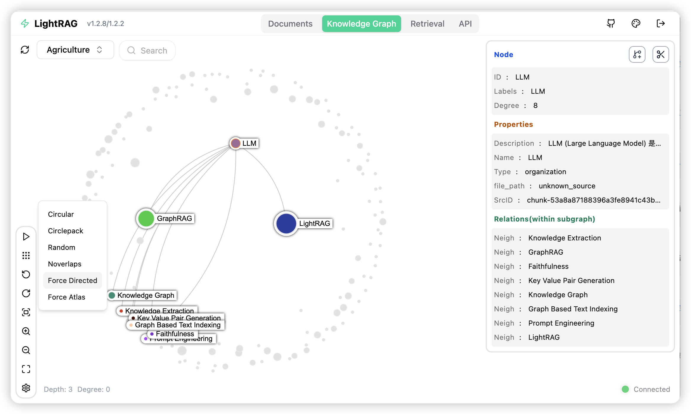

# OntoRAG

OntōRAG grounds LightRAG's knowledge graph in a formal ontology (YAGO) instead of letting arbitrary entity and relation types emerge ad hoc from the source text. It is a fork of [HKUDS/LightRAG](https://github.com/HKUDS/LightRAG); the upstream README follows below — everything in this fork header is OntoRAG-specific.

**Fork-specific additions** — an ontology-grounded taxonomy layer, images as first-class ontology inputs, a Markdown-canonical document intake with in-place OCR, and a hardened ingestion/scan path. All of it is listed in [Features](#features); the upstream feature set is retained in full (synced to LightRAG v1.5.7).

**License:** [MIT](LICENSE) — Copyright © 2025 LightRAG Team and © 2026 Jinsoo An (OntoRAG fork additions). Mirrors upstream LightRAG's MIT terms with the fork contributor credited alongside.

**Project conventions** are in [`AGENTS.md`](AGENTS.md).

---

## Features

### What the OntoRAG fork adds

- **Ontology-grounded taxonomy (YAGO 4.0)** — `ontorag/taxonomy/`: N-Triples loader for the pinned YAGO T-Box (`yago/`, SHA-256s in `manifest.py`), the class graph in any `BaseGraphStorage`, a ~200-class working vocabulary chosen by descendant count, a vector index over class labels + comments, and a `DocumentClassifier` that assigns weighted YAGO classes per document with a ≥50 %-of-top threshold rule and an `ontorag:Uncategorized` sentinel. Bootstrap and corpus-coverage CLIs live in `scripts/yago/`. Design: [GraphAndRagArchitecture §5](docs/GraphAndRagArchitecture.md#5-yago-taxonomy-layer-planned).
- **Classification that learns** (from the paperless-ngx review) — `classify_detailed()` runs a two-step prompt (the model names categories freely, then reconciles them to allow-listed candidates), matches free-form names to candidates exactly and fuzzily, and returns the leftovers as `unmatched_names` — the signal for vocabulary overlays instead of a silent *Uncategorized*. `neighbor_class_candidates()` votes the classes of the most similar already-classified documents into the candidate set; `NaiveBayesClassPrior` (numpy only) learns from confirmed assignments, re-ranks candidates and skips the LLM when confident. Standalone today; wiring into ingestion is Plan B.
- **Images as ontology inputs** — every embedded image is analysed by the VLM into `type` (its medium), `subject` (what it is *about*) and `ocr_text` (verbatim text baked into the pixels); the multimodal chunk carries `[Image Subject]` / `[Image Text]` sections so entity extraction sees OCR'd names and labels, and the image's knowledge-graph node is typed by medium (`chart`, `flowchart`, …) rather than the generic `drawing`. See [FileProcessingPipeline §4.1](docs/FileProcessingPipeline.md#41-what-this-stage-does).
- **Markdown-canonical intake (`pdf2md` engine)** — PDF, EPUB, DOCX, DOC, ODT and RTF are converted by the vendored structure-aware pdf2md converter into a `.textpack` (real headings, generated table of contents, tables, footnotes, extracted figures, and a `pdf2md.json` manifest) that becomes the catalogued and archived document; **the original file is never moved**, and a re-scan recognises converted originals (`converted_source`). Bibliographic metadata (title, authors, year, publisher, ISBN, arXiv, document type) lands in `doc_status.metadata` and the WebUI list. Optional extra `ontorag[pdf2md]` (PyMuPDF is AGPL-3.0). See [FileProcessingPipeline §3.8](docs/FileProcessingPipeline.md#38-using-the-pdf2md-engine-markdown-canonical-intake) and [OntoRAGSidecarFormat §11](docs/OntoRAGSidecarFormat.md#11-textpack-bundles-produced-by-pdf2md).
- **In-place OCR for scanned PDFs** — image-only PDFs are OCR'd with OCRmyPDF: the pre-OCR original is backed up to `__originals__/` (never overwritten) and the searchable PDF replaces it under the same name, so your library is upgraded rather than consumed. Modes `auto` / `force` / `redo`, rotation and deskew, unpaper cleaning, PDF/A output, size bounds and a `PDF_OCR_USER_ARGS` passthrough; one-retry exit-code policy (text layer found → force; PDF/A failed → plain PDF); encrypted or digitally signed PDFs are skipped, never rewritten; the recognizer is OCRmyPDF's (`ocrmypdf-appleocr`, `-easyocr`, `-paddleocr` plugins just work). Settings, tools and Tesseract language packs are validated once at server startup.
- **Scan stability delay** — `SCAN_STABILITY_DELAY` defers files modified within the last N seconds so a file still being copied into the input folder is never consumed half-written.
- **Converter-engine contract for third parties** — `ParseResult.canonical_source` / `document_metadata` let any parser plugin make a generated file the document of record; see [ThirdPartyParser](docs/ThirdPartyParser.md).
- **Test and CI hygiene** — CI runs every non-integration test (the upstream `-m offline` filter silently skipped `tests/api/` and the markdown parser suite) and builds the WebUI first; host-dependent suites skip with actionable reasons; `scripts/test.sh` sets up libcairo on macOS.

### Inherited from LightRAG (v1.5.7, retained in full)

- **Graph-based RAG core** — LLM entity/relation extraction with gleaning, entity/relation merging and summarisation, incremental inserts, document deletion with knowledge-graph regeneration, custom chunk patches, KG integrity audit and repair tools. API reference: [ProgramingWithCore](docs/ProgramingWithCore.md).
- **Six query modes** — `local`, `global`, `hybrid`, `naive`, `mix` (KG + vector; recommended with a reranker) and `bypass`; streaming, conversation history, per-query prompts, token budgets per entity/relation/chunk, and reranking via Cohere, Jina, Alibaba/DashScope or any OpenAI-style rerank API.
- **Role-specific LLM configuration** — independent models for the `EXTRACT`, `KEYWORD`, `QUERY` and `VLM` roles, each with its own binding, host, concurrency and cache identity. See [RoleSpecificLLMConfiguration](docs/RoleSpecificLLMConfiguration.md).
- **LLM and embedding providers** — OpenAI and OpenAI-compatible endpoints, Azure OpenAI, Ollama, Gemini, Anthropic, AWS Bedrock, Zhipu, NVIDIA, LMDeploy, LoLLMs, Jina and VoyageAI embeddings, Hugging Face, LlamaIndex. Options: [LLMProviderOptions](docs/LLMProviderOptions.md); asymmetric query/passage embeddings: [AsymmetricEmbedding](docs/AsymmetricEmbedding.md).
- **Pluggable storage** — four storage types (KV, vector, graph, document status) over JSON / NanoVectorDB / NetworkX for local use, PostgreSQL (pgvector; Apache AGE or the table-based `PGTableGraphStorage`), Neo4j, Memgraph, MongoDB, Redis, Milvus, Qdrant, Faiss, Chroma and OpenSearch; workspaces isolate tenants within one deployment. Migration tools for LLM caches and graph storage, and a vector-DB rebuild tool.
- **Document processing pipeline** — parser engines `legacy`, `native` (structure-aware DOCX with smart headings, Markdown, `.textpack`), `pdf2md`, and external MinerU / Docling services; five chunking strategies (fixed token, recursive character, semantic vector, paragraph-semantic, custom); per-suffix routing rules (`ONTORAG_PARSER`) and per-file filename hints; multimodal analysis of images, tables and equations via the VLM; a documented sidecar format; parse caching and forced re-parse; a third-party parser plugin registry and a parser debug CLI. See [FileProcessingPipeline](docs/FileProcessingPipeline.md), [ParagraphSemanticChunking](docs/ParagraphSemanticChunking.md), [ThirdPartyParser](docs/ThirdPartyParser.md), [ParserDebugCLI](docs/ParserDebugCLI.md).
- **Server, API and WebUI** — FastAPI REST API with an Ollama-compatible chat endpoint (use OntoRAG from Open WebUI and other Ollama clients); JWT account login, API-key auth and path whitelists; streaming scan/enqueue with bounded memory, admission control and request-body limits; a React WebUI with document management, an interactive knowledge-graph viewer and a retrieval console; branding/UI customization; multi-site deployment behind a path prefix; Gunicorn multi-worker launcher. See [OntoRAG-API-Server](docs/OntoRAG-API-Server.md), [UserDefinedUI](docs/UserDefinedUI.md), [MultiSiteDeployment](docs/MultiSiteDeployment.md).
- **Operations** — interactive setup wizard (`make env-*`), Docker Compose and Kubernetes deployments (signed GHCR images), offline/air-gapped installs, Langfuse tracing, RAGAS evaluation, token-usage tracking, knowledge-graph export, LLM-cache management, `uv.lock`-pinned dependencies. See [InteractiveSetup](docs/InteractiveSetup.md), [DockerDeployment](docs/DockerDeployment.md), [OfflineDeployment](docs/OfflineDeployment.md), [AdvancedFeatures](docs/AdvancedFeatures.md).

## Installation

**💡 Using uv for Package Management**: This project uses [uv](https://docs.astral.sh/uv/) for fast and reliable Python package management. Install uv first: `curl -LsSf https://astral.sh/uv/install.sh | sh` (Unix/macOS) or `powershell -c "irm https://astral.sh/uv/install.ps1 | iex"` (Windows)

> **Note**: You can also use pip if you prefer, but uv is recommended for better performance and more reliable dependency management.
>
> **📦 Offline Deployment**: For offline or air-gapped environments, see the [Offline Deployment Guide](./docs/OfflineDeployment.md) for instructions on pre-installing all dependencies and cache files.

### Install OntoRAG Server

The OntoRAG Server is designed to provide Web UI and API support. The Web UI facilitates document indexing, knowledge graph exploration, and a simple RAG query interface. OntoRAG Server also provide an Ollama compatible interfaces, aiming to emulate OntoRAG as an Ollama chat model. This allows AI chat bot, such as Open WebUI, to access OntoRAG easily.

* Install from PyPI

```bash
### Install OntoRAG Server as tool using uv (recommended)
uv tool install "ontorag-hku[api]"

### Or using pip
# python -m venv .venv
# source .venv/bin/activate  # Windows: .venv\Scripts\activate
# pip install "ontorag-hku[api]"

### Build front-end artifacts
cd ontorag_webui
bun install --frozen-lockfile
bun run build
cd ..

# Setup env file
# Obtain the env.example file by downloading it from the GitHub repository root
# or by copying it from a local source checkout.
cp env.example .env  # Update the .env with your LLM and embedding configurations
# Launch the server
ontorag-server
```

* Installation from Source

```bash
git clone https://github.com/machinarii/OntoRAG.git
cd OntoRAG

# Bootstrap the development environment (recommended)
make dev
source .venv/bin/activate  # Activate the virtual environment (Linux/macOS)
# Or on Windows: .venv\Scripts\activate

# make dev installs the test toolchain plus the full offline stack
# (API, storage backends, and provider integrations), then builds the frontend.
# Run make env-base or copy env.example to .env before starting the server.

# Equivalent manual steps with uv
# Note: uv sync automatically creates a virtual environment in .venv/
uv sync --extra test --extra offline
source .venv/bin/activate  # Activate the virtual environment (Linux/macOS)
# Or on Windows: .venv\Scripts\activate

### Or using pip with virtual environment
# python -m venv .venv
# source .venv/bin/activate  # Windows: .venv\Scripts\activate
# pip install -e ".[test,offline]"

# Build front-end artifacts
cd ontorag_webui
bun install --frozen-lockfile
bun run build
cd ..

# setup env file
make env-base  # Or: cp env.example .env and update it manually
# Launch API-WebUI server
ontorag-server
```

* Launching the OntoRAG Server with Docker Compose

```bash
git clone https://github.com/machinarii/OntoRAG.git
cd OntoRAG
cp env.example .env  # Update the .env with your LLM and embedding configurations
# modify LLM and Embedding settings in .env
docker compose up
```

> Historical versions of OntoRAG docker images can be found here: [OntoRAG Docker Images]( https://github.com/HKUDS/OntoRAG/pkgs/container/ontorag)
>
> Official GHCR images published by GitHub Actions are signed with Sigstore Cosign using GitHub OIDC. See [docs/DockerDeployment.md](./docs/DockerDeployment.md#verify-official-ghcr-images-with-cosign) for verification commands.

### Create .env File With Setup Tool

Instead of editing `env.example` by hand, use the interactive setup wizard to generate a configured `.env` and, when needed, `docker-compose.final.yml`:

```bash
make env-base           # Required first step: LLM, embedding, reranker
make env-storage        # Optional: storage backends and database services
make env-server         # Optional: server port, auth, and SSL
make env-base-rewrite   # Optional: force-regenerate wizard-managed compose services
make env-storage-rewrite # Optional: force-regenerate wizard-managed compose services
make env-security-check # Optional: audit the current .env for security risks
```

For full description of every target see [docs/InteractiveSetup.md](./docs/InteractiveSetup.md).
The setup wizards update configuration only; run `make env-security-check` separately to audit the
current `.env` for security risks before deployment.
By default, rerunning the setup preserves unchanged wizard-managed compose service blocks; use a
`*-rewrite` target only when you need to rebuild those managed blocks from the bundled templates.

### Install  OntoRAG Core

* Install from source (Recommended)

```bash
cd OntoRAG
# Note: uv sync automatically creates a virtual environment in .venv/
uv sync
source .venv/bin/activate  # Activate the virtual environment (Linux/macOS)
# Or on Windows: .venv\Scripts\activate

# Or: pip install -e .
```

* Install from PyPI

```bash
uv pip install ontorag-hku
# Or: pip install ontorag-hku
```

### Optional: Markdown-canonical intake for PDF / EPUB / DOCX (pdf2md)

```bash
uv sync --extra pdf2md            # or: pip install 'ontorag[pdf2md]'
# scanned PDFs also need tesseract + ghostscript; DOC/ODT/RTF need LibreOffice
```

With the `pdf2md` engine routed for a suffix (e.g. `ONTORAG_PARSER=pdf:pdf2md-iteP,epub:pdf2md-iteP,*:native-teP,*:legacy-R`), each source is converted into a **`.textpack`** — structure-aware Markdown with real headings, a table of contents, tables, footnotes and the figures — which becomes the catalogued and archived document; **the original file is never moved**. Scanned PDFs are OCR'd in place with OCRmyPDF (the pre-OCR original is kept in `__originals__/`), and bibliographic metadata (title, authors, year, ISBN, document type) lands in `doc_status.metadata` and the WebUI. PyMuPDF, which pdf2md depends on, is AGPL-3.0 — install the extra only where that licence is acceptable. Details: `docs/FileProcessingPipeline.md` §3.8.

## Quick Start

### LLM and Technology Stack Requirements for OntoRAG

OntoRAG's demands on the capabilities of Large Language Models (LLMs) are significantly higher than those of traditional RAG, as it requires the LLM to perform entity-relationship extraction tasks from documents. Configuring appropriate Embedding and Reranker models is also crucial for improving query performance.

- **LLM Selection**:
  - It is recommended to use an LLM with at least 32 billion parameters.
  - The context length should be at least 32KB, with 64KB being recommended.
  - It is not recommended to choose reasoning models during the document indexing stage.
  - During the query stage, it is recommended to choose models with stronger capabilities than those used in the indexing stage to achieve better query results.
- **Embedding Model**:
  - A high-performance Embedding model is essential for RAG.
  - We recommend using mainstream multilingual Embedding models, such as: `BAAI/bge-m3` and `text-embedding-3-large`.
  - **Important Note**: The Embedding model must be determined before document indexing, and the same model must be used during the document query phase. For certain storage solutions (e.g., PostgreSQL), the vector dimension must be defined upon initial table creation. Therefore, when changing embedding models, it is necessary to delete the existing vector-related tables and allow OntoRAG to recreate them with the new dimensions.
- **Reranker Model Configuration**:
  - Configuring a Reranker model can significantly enhance OntoRAG's retrieval performance.
  - When a Reranker model is enabled, it is recommended to set the "mix mode" as the default query mode.
  - We recommend using mainstream Reranker models, such as: `BAAI/bge-reranker-v2-m3` or models provided by services like Jina.

### Quick Start for OntoRAG Server

The OntoRAG Server is designed to provide Web UI and API support. The OntoRAG Server offers a comprehensive knowledge graph visualization feature. It supports various gravity layouts, node queries, subgraph filtering, and more. For more information about OntoRAG Server, please refer to [OntoRAG Server](./docs/OntoRAG-API-Server.md).




### Quick Start for OntoRAG core

To get started with OntoRAG core, refer to the sample codes available in the `examples` folder. Additionally, a [video demo](https://www.youtube.com/watch?v=g21royNJ4fw) demonstration is provided to guide you through the local setup process. If you already possess an OpenAI API key, you can run the demo right away:

```bash
### you should run the demo code with project folder
cd OntoRAG
### provide your API-KEY for OpenAI
export OPENAI_API_KEY="sk-...your_opeai_key..."
### download the demo document of "A Christmas Carol" by Charles Dickens
curl https://raw.githubusercontent.com/gusye1234/nano-graphrag/main/tests/mock_data.txt > ./book.txt
### run the demo code
python examples/ontorag_openai_demo.py
```

For a streaming response implementation example, please see `examples/ontorag_openai_compatible_demo.py`. Prior to execution, ensure you modify the sample code's LLM and embedding configurations accordingly.

**Note 1**: When running the demo program, please be aware that different test scripts may use different embedding models. If you switch to a different embedding model, you must clear the data directory (`./dickens`); otherwise, the program may encounter errors. If you wish to retain the LLM cache, you can preserve the `kv_store_llm_response_cache.json` file while clearing the data directory.

**Note 2**: Only `ontorag_openai_demo.py` and `ontorag_openai_compatible_demo.py` are officially supported sample codes. Other sample files are community contributions that haven't undergone full testing and optimization.

## Programming with OntoRAG Core

For the complete Core API reference — including init parameters, `QueryParam`, LLM/embedding provider examples (OpenAI, Ollama, Azure, Gemini, HuggingFace, LlamaIndex), reranker injection, insert operations, entity/relation management, and delete/merge — see **[docs/ProgramingWithCore.md](./docs/ProgramingWithCore.md)**.

> ⚠️ **If you would like to integrate OntoRAG into your project, we recommend utilizing the REST API provided by the OntoRAG Server**. OntoRAG Core is typically intended for embedded applications or for researchers who wish to conduct studies and evaluations.

### Advanced Features

OntoRAG provides additional capabilities including token usage tracking, knowledge graph data export, LLM cache management, Langfuse observability integration, and RAGAS-based evaluation. See **[docs/AdvancedFeatures.md](./docs/AdvancedFeatures.md)**.

### Multimodal Document Processing

OntoRAG Server includes a multimodal document pipeline for PDFs, Office documents, EPUBs, images, tables, and formulas. Parsing runs through the built-in `native` engine (DOCX, Markdown, `.textpack`), the `pdf2md` engine (PDF / EPUB / DOC → Markdown-canonical `.textpack`, see above), or external MinerU / Docling services; multimodal indexing runs in the OntoRAG pipeline. Every embedded image is analysed by the VLM into `type` (medium), `subject` (what it is about) and `ocr_text` (text baked into the pixels), and becomes a typed knowledge-graph node — so charts, diagrams and scanned tables contribute subject matter and labels to the ontology, not just a caption. For setup details, see **[docs/FileProcessingPipeline.md](./docs/FileProcessingPipeline.md)** and **[docs/AdvancedFeatures.md](./docs/AdvancedFeatures.md)**.

## OntoRAG Contributors

<div>
  <a href="https://github.com/HKUDS/LightRAG?tab=readme-ov-file#-contribution">Please checkout all of the contributors for OntoRAG who made it happen</a>
</div>

---

## Sources & Attribution

**Upstream:**
- [HKUDS/LightRAG](https://github.com/HKUDS/LightRAG) — the base RAG framework this fork extends. arXiv: [2410.05779](https://arxiv.org/abs/2410.05779).

**Data sources used by the OntoRAG-fork additions:**
- **YAGO 4.0** (release 2020-02-24) — the T-Box files (`yago-wd-class.nt`, `yago-wd-schema.nt`, `yago-wd-shapes.nt`) committed at `yago/` originate from [yago-knowledge.org/data/yago4/full/2020-02-24/](https://yago-knowledge.org/data/yago4/full/2020-02-24/). YAGO is licensed under [CC BY-SA 3.0](https://creativecommons.org/licenses/by-sa/3.0/). Project page: [yago-knowledge.org](https://yago-knowledge.org/).

**License:** Single [MIT](LICENSE) covering both the upstream LightRAG code (© 2025 LightRAG Team) and the OntoRAG fork additions (© 2026 Jinsoo An, contributor). Same MIT terms as upstream.

**Bundled and optional components (OntoRAG-fork additions):**
- **pdf2md** — the structure-aware PDF / EPUB / DOCX → Markdown converter vendored at `ontorag/parser/pdf2md/_pdf2md.py` (its README ships alongside as `README.pdf2md.md`). Written by this repository's author; used unchanged except for two documented edits.
- [PyMuPDF](https://pymupdf.readthedocs.io/) — PDF rendering for pdf2md. **AGPL-3.0** (or a commercial licence from Artifex); installed only through the optional `ontorag[pdf2md]` extra, never by the base install.
- [OCRmyPDF](https://ocrmypdf.readthedocs.io/) — in-place OCR of scanned PDFs (MPL-2.0), driving [Tesseract](https://github.com/tesseract-ocr/tesseract) (Apache-2.0) by default; optional recognizer plugins (`ocrmypdf-appleocr`, `ocrmypdf-easyocr`, `ocrmypdf-paddleocr`) carry their own licences. Also part of the `[pdf2md]` extra; Tesseract and Ghostscript (AGPL-3.0) are system packages.
- [LibreOffice](https://www.libreoffice.org/) (MPL-2.0) — optional system dependency pdf2md uses to convert DOC / ODT / RTF to DOCX.
